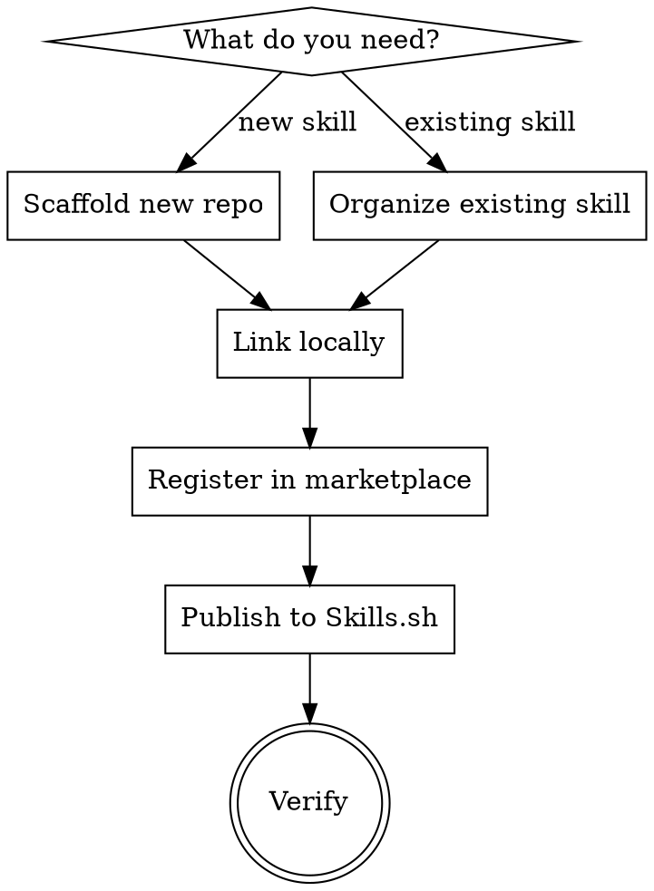

# Skill Publisher

Automate the full lifecycle of creating, organizing, publishing, and distributing agent skills across all major AI coding environments.

## When to Use

- Creating a new skill repo from scratch
- Publishing an existing local skill to GitHub / Skills.sh
- Adding cross-platform configs to an existing skill
- Registering a skill in a marketplace
- Setting up local symlinks for development
- Validating a SKILL.md against the agentskills.io spec

## Workflow



## 1. Scaffold a New Skill Repo

Create repo at `~/dev/skills/<skill-name>/` with this structure:

```
<skill-name>/
├── skills/
│   └── <skill-name>/
│       ├── SKILL.md              # agentskills.io spec format
│       └── references/           # Supporting docs (if needed)
├── .claude-plugin/
│   └── plugin.json               # Claude Code discovery
├── .cursor-plugin/
│   └── plugin.json               # Cursor discovery
├── .codex/
│   └── INSTALL.md                # Codex install instructions
├── .opencode/
│   └── INSTALL.md                # OpenCode install instructions
├── GEMINI.md                     # Gemini CLI (@./skills/<name>/SKILL.md)
├── AGENTS.md                     # Generic agent instructions
├── package.json                  # For npx skills add
├── LICENSE                       # MIT
└── README.md                     # Install instructions for all envs
```

**Why `skills/<name>/SKILL.md` not root:** Claude Code plugin system expects skills inside a `skills/` directory. This path satisfies both Skills.sh and plugin discovery.

### plugin.json template

```json
{
  "name": "<skill-name>",
  "description": "<one-line description>",
  "version": "1.0.0",
  "author": { "name": "Nico Acosta" },
  "homepage": "https://github.com/NicoAcosta/<skill-name>",
  "repository": "https://github.com/NicoAcosta/<skill-name>",
  "license": "MIT",
  "keywords": ["<relevant>", "<keywords>"]
}
```

Use same JSON for both `.claude-plugin/` and `.cursor-plugin/`.

### GEMINI.md template

```markdown
This repo contains the **<skill-name>** skill for <brief purpose>.

@./skills/<skill-name>/SKILL.md
```

### AGENTS.md template

```markdown
# <Skill Name>

<What it does in 2-3 sentences.>

## Usage

Read the full skill at `skills/<skill-name>/SKILL.md`.
```

## 2. Organize Existing Skill

Validate SKILL.md against agentskills.io spec:

| Check | Rule |
|-------|------|
| Name format | Lowercase alphanumeric + hyphens, 1-64 chars, no leading/trailing hyphens |
| Name match | Must match parent directory name |
| Description | Starts with "Use when...", under 500 chars, NO workflow summary |
| Frontmatter | Valid YAML with `name` and `description` fields |
| References | All linked files exist and are reachable |
| Token budget | <500 words for non-reference skills |

**CSO anti-pattern check:** If description summarizes workflow, Claude follows the description instead of reading the full skill. Description must only contain triggering conditions.

## 3. Link Locally

```bash
# Clone repo
git clone https://github.com/NicoAcosta/<skill-name>.git ~/dev/skills/<skill-name>/

# Symlink into Claude Code skills directory
ln -s ~/dev/skills/<skill-name>/skills/<skill-name> ~/.claude/skills/<skill-name>

# Verify
ls -la ~/.claude/skills/<skill-name>/SKILL.md
```

Note: Symlink points to `skills/<name>/` inside the repo, not the repo root.

## 4. Register in Marketplace

Add entry to `~/dev/skills/agent-skills/skills-manifest.json`:

```json
{
  "name": "<skill-name>",
  "repo": "NicoAcosta/<skill-name>",
  "path": "skills/<skill-name>",
  "version": "1.0.0"
}
```

Then sync the skill files into the marketplace repo:

```bash
cp -r ~/dev/skills/<skill-name>/skills/<skill-name>/ ~/dev/skills/agent-skills/skills/<skill-name>/
cd ~/dev/skills/agent-skills
git add -A && git commit -m "add: <skill-name> skill" && git push
```

## 5. Publish to Skills.sh

```bash
cd ~/dev/skills/<skill-name>

# Init, commit, create repo
git init && git add -A
git commit -m "Initial release: <Skill Name> agent skill"
gh repo create NicoAcosta/<skill-name> --public --source=. --description "<description>" --push

# Tag release (triggers Skills.sh listing)
git tag v1.0.0 && git push origin v1.0.0
```

Verify: `npx skills add NicoAcosta/<skill-name>`

## Quick Reference

| Environment | Install command |
|---|---|
| Skills.sh | `npx skills add NicoAcosta/<skill-name>` |
| Claude Code | `/plugin marketplace add NicoAcosta/agent-skills` |
| Cursor | `/add-plugin <skill-name>` |
| Codex | Symlink per `.codex/INSTALL.md` |
| OpenCode | Add to `opencode.json` per `.opencode/INSTALL.md` |
| Gemini CLI | `gemini extensions install https://github.com/NicoAcosta/<skill-name>` |
| Manual | Clone repo, read `AGENTS.md` |

## Common Mistakes

| Mistake | Fix |
|---------|-----|
| SKILL.md at repo root | Must be at `skills/<name>/SKILL.md` for plugin discovery |
| Description summarizes workflow | Only triggering conditions -- no process steps |
| Symlink points to repo root | Point to `skills/<name>/` inside repo |
| Forgot cross-platform configs | Every repo needs .claude-plugin, .cursor-plugin, .codex, .opencode, GEMINI.md, AGENTS.md |
| No release tag | Skills.sh needs a git tag to list the skill |
| Forgot to update marketplace manifest | Add to `skills-manifest.json` and sync files |
